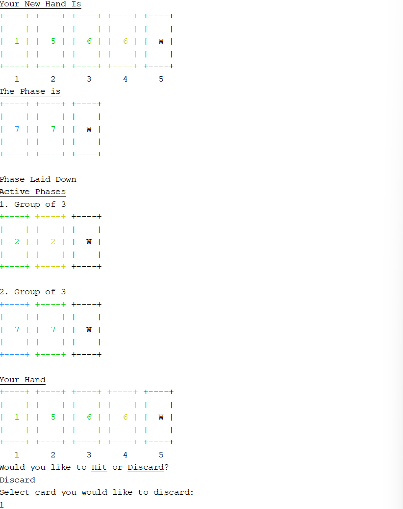

# Introduction
Phase 10 is a groups and runs based card game where players compete to put down a specific "Phase" (a defined pair or sets, runs, or cards of one color). That round continues until a player is able to build off of the sets, runs, or cards of one color that have been put down and runs out of cards. The winner of the game is the first person to complete all 10 phases. If both players finish the 10th phase on the same round, who ever has the lowest score wins. 

The development took about 20 hours. Altogether, the code is 1343 lines, comprised of 393 lines of C header files and 950 lines of C++ code. These make up 10 separate classes. 

The code can be found on Github [https://github.com/Thomas-Kleist/Project_1_Phase_10_Game](https://github.com/Thomas-Kleist/Project_1_Phase_10_Game).

# Approach to Development
I approached this design modularly, first by building a card class. Then a display system to show several cards at once in multiple colors. Next, a player class and to hold cards for the player. Next a deck, a way of shuffling, and a way to deal cards to the player. After that, I built a system for players to pick up and discard cards into the appropriate piles. Next, I built a main game class that controls the overall flow of the game and started designing phases for players to lay out cards. Finally, I built a system to hit to play their remaining cards, as well as a system to start and the next round or end the game when a player is out of cards.

Throughout this, I tried to commit the code to Github often, ideally after each feature was developed, so I could easily roll back if something broke, or make a branch to work on a different feature for some time.

# Game Rules

Each player starts with 10 cards. On a players turn, they draw a card either from the discard pile or the draw pile. At the end of their turn, they will discard a card into the discard pile. 

At the start of the round, the players objective is to complete their phase on lay out their cards onto the table. If a player lays out their phase, they will work on the next phase in the following round. 

- Phase 1: 2 sets of 3
- Phase 2: 1 set of 3 + 1 run of 4
- Phase 3: 1 set of 4 + 1 run of 4
- Phase 4: 1 run of 7
- Phase 5: 1 run of 8
- Phase 6: 1 run of 9
- Phase 7: 2 sets of 4
- Phase 8: 7 cards of one color
- Phase 9: 1 set of 5 + 1 set of 2
- Phase 10: 1 set of 5 + 1 set of 3

Once a player has played their cards, they can play the rest of their cards by expanding any other phase on the table. The round is over when a player runs out of cards.

At the end of the round, players get a score based on the cards left in their hands. Cards 1-9 are each worth 5 points, cards 10-12 are worth 10 points, a skip card is worth 15 points, and a wild card is worth 25 points.

At the end of the round where one or more people have completed phase 10, the player who has completed phase 10 and has the least amount of points is the winner and the game is over. 

A complete set of rules can be found on the Wikipedia page for Phase 10, [https://en.wikipedia.org/wiki/Phase_10](https://en.wikipedia.org/wiki/Phase_10).

# Description of Code
The code is organized into several classes, each with distinct roles.

* Game - The main game object that controls the flow of the game.
* Deck - The object that holds the deck. It is responsible for shuffling, dealing, and holding the draw and discard piles.
* Card - The card class holds details about each card, including its face value, color, and points value.
* Player - The player class handles each players hand, score, and phase.
* Display - A helper class to assist with drawing to the terminal.
  * Color - A helper class of display that is used to nicely handle color on the terminal.
* Phase - The base class used for the three types of phases. Each phase is responsible for ensuring that only the correct cards are added.
  * Group - This class checks that only sets can be made.
  * Run - This class checks that only runs can be made.
  * ColorPhase - This class checks that only cards of one color are added to the phase.
 
# Sample

The following screenshots are a sample of a player drawing a card, then laying down the first phase of the game. 





# Checkoff Sheet
1. Container Classes
    * Sequences
        - `std::list<>` is used to store the hand in player the player class. This is in 'player.h' line 33.
    * Associative Containers
        - `std::set<std::string>` is used to store the available cards that the player can hit. This is in 'game.cpp' line 166.
        - `std::map<std::string, Color>` is used as a map from strings to colors, so we can use the string "Red" to easily get the corresponding ANSI color value. This is in 'color.h' line 33.
    * Container Adapters
        - `std::stack<Card>` is used to the discard pile in the deck class. This is in 'Deck.h' line 31.
        - `std::deque<Card>` is used to store the draw pile in the deck class. This is in 'Deck.h' line 30.
2. Iterators
    * `std::list<Phase*>::iterator` is used to access a specific phase in a list of phases. This is in 'Game.cpp' line 194.
    * `std::list<Phase*>::iterator` is used to fill all the phases in a list. This is in 'Game.cpp' line 134. 
    * `std::list<Card>::iterator` is used to access a specific card in a list of cards. This is in 'player.cpp' line 58.
3. Algorithms
    * Non-mutating Algorithms
        - `std::for_each` is used to display all the cards in a list. This is in `Display.h` line 61, 67, 73, 81, 87.
    * Mutating Algorithms
        - `std::shuffle` is used to shuffle the draw pile at the start of the round and when reshuffling the discard pile. This is in `Deck.cpp` line 47.
    * Organization
        - `std::list::sort` is used to sort the list of cards that represents the players hand. This is in  `Player.cpp` line 38 and line 40. 

# Project 2 Additions
1. Operator Overloading
    - Overloading the `<` operator for the cards object for sorting on line 28 of `Card.h`
2. Recursion
    - The `turn` function of the `game` class is recursive, so the next turn is called at the end of the turn. 
3. Recursive Sort
    - Merge sort is implemented to sort the players hand on line 69 of `Player.cpp`
4. Hashing
    - Implement HASHMAP for phase requirements (Monday's job)
5. Trees
    - A tree is used to sort the players hand by color. This isn't really how a tree should be used (I am filling a tree, then reading from it in order, then deleting it as a sorting algorithm), but it shows how it works. It is in the `treeSort` function on line 122 in `Player.cpp`


# Documentation

The majority of the game logic is in `Game::turn`.

Pseudocode:

* Game::turn
    - Display which players turn it is
    - If _player had not laid out_
        - Print which phase they are working on
    - Display draw and discard piles.
    - Display active phases on the table. 
    - Display players hand.
    - Ask if player will draw from draw or discard pile.
    - If _play selects discard_
      - pop card from discard pile and add to player hand
    - Else
      - pop card from draw pile and add to player hand
    - If _player has not laid out_
      - Ask user if they want to lay out cards or discard
      - If _player wants to lay out_
        - Get the phases in the players current phase
        - Fill each phase with player input
        - If _player fills out all phase_
          - Add phases to active phases on table
          - Mark that player has laid out and can now hit 
        - Else
          - Move cards back into player hand
      - Else if _player wants to discard_
        - Ask player which card
        - Remove card from player hand and push to discard pile
    - Else if _player has laid out_
      - Ask player if they want to hit or discard
      - If _player wants to hit_
        - Ask player which phase they want to hit
        - Ask player which card they want to hit
        - If _hit is valid_
          - Remove card from player hand and add to phase
          - If _player hand is empty_
            - End round and continue to next
        - Else _ask player if they want to hit or discard_
      - Else if _player wants to discard_
        - Ask player which card
        - Remove card from player hand and push to discard pile
        - If _player hand is empty_
          - End round and continue to next
    - Return to top

## UML Diagram: 
A UML Diagram of the Phase class and its subclasses


## Flow Chart:
A simplified flowchart of a turn


# Code

## main.cpp
```c++
/* 
 * File:   main.cpp
 * Author: Thomas Kleist
 *
 * Created on November 2, 2024, 10:32 AM
 */

#include <cstdlib>
#include <iostream>
#include "Display.h"
#include "Game.h"

using namespace std;

int main(int argc, char** argv) {
    Display::PrintBold("Phase 10");
    Display::NewLine();

    Game *game = new Game();
        
    game->setupRound();
    
    int playerTurn = 1;
    while (true) {
        bool skip = game->turn(playerTurn);
        if (!skip) {
            playerTurn = (playerTurn==1)?2:1;
        }
    }
    
    return 0;
}
```

## Card.h
```h
/* 
 * File:   Card.h
 * Author: Thomas Kleist
 * 
 *
 * Created on November 2, 2024, 11:10 AM
 */

#ifndef CARD_H
#define CARD_H

#include <string>

class Card {
public:
    // Only to be used for wilds, skips, or blank
    Card(int faceValue);
    Card(int faceValue, std::string colorValue);
    Card(const Card& orig);
    std::string getColor() { return color; }
    int getColorNum() { if (color == "Red") return 0; else if (color == "Blue") return 1; else if (color == "Green") return 2; else if (color == "Yellow") return 3; else return 4; }
    std::string getDisplayValue();
    int getFaceValue() { return faceValue; }
    int getPointValue() {if (faceValue <= 12) return 5; if (faceValue == 13) return 25; if (faceValue == 14) return 15; return 0; }
    void setPhaseValue(int value) { phaseValue = value; }
    int getPhaseValue() { return phaseValue; }
    ~Card();
private:
    int faceValue;
    std::string color;
    int phaseValue;
};

#endif /* CARD_H */

```

## Card.cpp
```c++
/* 
 * File:   Card.cpp
 * Author: Thomas Kleist
 * 
 * Created on November 2, 2024, 11:10 AM
 */

#include <string>
#include "Card.h"

Card::Card(int faceValue) {
    this->faceValue = faceValue;
    this->phaseValue = faceValue;
    this->color = "Black";
}

Card::Card(int faceValue, std::string colorValue) {
    this->faceValue = faceValue;
    this->phaseValue = faceValue;
    this->color = colorValue;
}

Card::Card(const Card& orig) {
    // Copy Values
    this->faceValue = orig.faceValue;
    this->phaseValue = orig.phaseValue;
    this->color = orig.color;
}

std::string Card::getDisplayValue() {
    // Handle Blank Card
    if (faceValue == 0) return "";
    // Handle Wild Card
    if (faceValue == 13) return "W";
    // Handle Skip Card
    if (faceValue == 14) return "S";
    // Handle Number Cards
    return std::to_string(faceValue);
}

Card::~Card() {
    
}
```

## Color.h
```h
/* 
 * File:   Color.h
 * Author: Thomas Kleist
 *
 * Created on November 2, 2024, 10:38 AM
 */

#ifndef COLOR_H
#define COLOR_H

#include <map>
#include <string>
#include <cinttypes>

/* This class represents a Color -- specifically a 4 bit color based on ANSI escape sequences. See https://stackoverflow.com/questions/4842424/list-of-ansi-color-escape-sequences for more info */
class Color {
public:
    Color() { };
    //Color(std::string);
    Color(uint8_t);
    Color(const Color& orig);

    virtual ~Color();

    uint8_t AsFG() { return inner + 30; }
    uint8_t AsBG() { return inner + 40; }
    static std::map<std::string, Color> CreateColorMap();


    uint8_t inner;
};

extern std::map<std::string, Color> COLOR;

#endif /* COLOR_H */

```

## Color.cpp
``` c++
/* 
 * File:   main.cpp
 * Author: Thomas Kleist
 *
 * Created on November 2, 2024, 10:50 AM
 */

#include "Color.h"

#include <map>
#include <string>

std::map<std::string, Color> COLOR = Color::CreateColorMap();

Color::Color(uint8_t val) : inner(val) {
}


Color::Color(const Color& orig) {
}

Color::~Color() {
}

// Creates a map of all of the possible 4-bit ANSI colors.
std::map<std::string, Color> Color::CreateColorMap() {
    std::map<std::string, Color> m;
    m["Black"] = Color(0);
    m["Red"] = Color(1);
    m["Green"] = Color(2);
    m["Yellow"] = Color(3);
    m["Blue"] = Color(4);
    m["Magenta"] = Color(5);
    m["Cyan"] = Color(6);
    m["White"] = Color(7);

    return m;
}
```

## ColorPhase.h
``` h
/* 
 * File:   ColorPhase.h
 * Author: Thomas Kleist
 *
 * Created on November 3, 2024, 3:09 PM
 */

#ifndef COLORPHASE_H
#define COLORPHASE_H

#include <string>
#include "Phase.h"

class ColorPhase : public Phase {
public:
    explicit ColorPhase(int x) : Phase(x) { }
    virtual ~ColorPhase();
    bool addCard(Card);
    void printType() override;
    void addAvailableCards (std::set<std::string>& setOfCards) { if (!empty()) setOfCards.insert(color); }
private:
    std::string color;
};

#endif /* COLORPHASE_H */
```

## ColorPhase.cpp
``` c++
/* 
 * File:   ColorPhase.cpp
 * Author: Thomas Kleist
 * 
 * Created on November 3, 2024, 3:09 PM
 */

#include "ColorPhase.h"
#include "Display.h"

ColorPhase::~ColorPhase() {
}

bool ColorPhase::addCard(Card card) {
    // Do not add skip cards
    if (card.getFaceValue() == 14) return false;
    
    if (cards.empty()) {
        // If adding a wild card, ask for which value to use
        if (card.getFaceValue() == 13) {
            std::string colorSel = "";
            Display::Print("Select which color you would like the wild card to be (Red, Blue, Green, or Yellow):");
            Display::NewLine();
            while (!(colorSel == "Red" || colorSel == "Blue" || colorSel == "Green" || colorSel == "Yellow"))
                std::cin >> colorSel;
            color = colorSel;
        } else {
            color = card.getColor();
        }
        cards.push_back(card);
        return true;
    }
    
    if (card.getFaceValue() == 13) {
        cards.push_back(card);
        return true;
    }
    
    if (card.getColor() == color) {
        cards.push_back(card);
        return true;
    }
    
    return false;
}

void ColorPhase::printType() {
    Display::Print(requiredSize);
    Display::Print(" Cards of One Color");
}
```

## Deck.h
``` h
/* 
 * File:   Deck.h
 * Author: Thomas Kleist
 *
 * Created on November 2, 2024, 5:10 PM
 */

#ifndef DECK_H
#define DECK_H

#include <deque>
#include <stack>
#include "Card.h"
#include "Player.h"

class Deck {
public:
    Deck();
    Deck(const Deck& orig);
    virtual ~Deck();
    
    void shuffleDraw();
    void deal(Player*);
    void drawPiles();
    Card drawFromDiscard();
    Card drawFromDrawPile();
    void discardCard(Card);
    
private:
    std::deque<Card> drawPile;
    std::stack<Card> discardPile;
};

#endif /* DECK_H */
```

## Deck.cpp
``` c++
/* 
 * File:   Deck.cpp
 * Author: Thomas Kleist
 * 
 * Created on November 2, 2024, 5:10 PM
 */

#include <algorithm>
#include "Deck.h"
#include "Player.h"
#include <random>       // std::default_random_engine
#include <chrono>       // std::chrono::system_clock
#include "Display.h"

Deck::Deck() {
    // Push number cards
    for (int i = 1; i <= 12; i++) {
        drawPile.push_front(*(new Card(i, "Blue")));
        drawPile.push_front(*(new Card(i, "Blue")));
        drawPile.push_front(*(new Card(i, "Green")));
        drawPile.push_front(*(new Card(i, "Green")));
        drawPile.push_front(*(new Card(i, "Red")));
        drawPile.push_front(*(new Card(i, "Red")));
        drawPile.push_front(*(new Card(i, "Yellow")));
        drawPile.push_front(*(new Card(i, "Yellow")));
    }
    for (int i = 0; i < 8; i++) {
        drawPile.push_front(*(new Card(13)));
    }
    for (int i = 0; i < 4; i++) {
        drawPile.push_front(*(new Card(14)));
    }
    shuffleDraw();
    discardPile.push(drawPile.front());
    drawPile.pop_front();
}

Deck::Deck(const Deck& orig) {
}

Deck::~Deck() {
}

void Deck::shuffleDraw() {
    unsigned seed = std::chrono::system_clock::now().time_since_epoch().count();

    std::shuffle(drawPile.begin(), drawPile.end(), std::default_random_engine(seed));
}

void Deck::deal(Player *player) {
    for (int i = 0; i < 10; i++) {
        player->addCardToHand(drawPile.front());
        drawPile.pop_front();
    }
}

void Deck::drawPiles() {
    std::list<Card> toDisplay;
    toDisplay.push_front(discardPile.top());
    toDisplay.push_front(*(new Card(0)));
    Display::PrintCards(toDisplay);
    Display::BeginColor("Black");
    Display::Print(" Draw  Discard");
    Display::NewLine();
}


Card Deck::drawFromDiscard() {
    Card toReturn = discardPile.top();
    discardPile.pop();
    return toReturn;
}

Card Deck::drawFromDrawPile() {
    Card toReturn = drawPile.front();
    drawPile.pop_front();
    
    if (drawPile.empty()) {
        while(discardPile.empty() == false) {
            drawPile.push_front(discardPile.top());
            discardPile.pop();
        }
        shuffleDraw();
        discardPile.push(drawPile.front());
        drawPile.pop_front();
    }
    
    return toReturn;
}

void Deck::discardCard(Card card) {
    discardPile.push(card);
}
```

## Display.h
```h 
/* 
 * File:   Display.h
 * Author: Thomas Kleist
 *
 * Created on November 2, 2024, 10:35 AM
 */

#ifndef DISPLAY_H
#define DISPLAY_H

#include <iostream>
#include <list>
#include <iomanip>
#include <string>
#include "Color.h"
#include "Card.h"

class Display {
    public:
      static void BeginBold() { std::cout << "\033[1m"; }

      static void BeginUnderline() { std::cout << "\033[4m"; }

      static void BeginColor(std::string col) { std::cout << "\033[" << unsigned(COLOR[col].AsFG()) << "m"; }

      static void NewLine() { std::cout << std::endl; }

      static void EndFormat() { std::cout << "\033[0m"; }
      
      static void Clear() { NewLine(); NewLine(); NewLine(); NewLine(); NewLine(); NewLine(); NewLine(); NewLine(); }

      template <typename T> static void Print(T x) {
        std::cout << x;
      }

      template <typename T> static void PrintBold(T x) {
        Display::BeginBold();
        std::cout << x;
        Display::EndFormat();
      }

      template <typename T> static void PrintUnderlined(T x) {
        Display::BeginUnderline();
        std::cout << x;
        Display::EndFormat();
      }
      
      static void PrintCards(Card card) {
            BeginColor(card.getColor());
            Print("+----+\n");
            Print("|    |\n");
            Print("| ");
            std::cout << std::setw(2) << card.getDisplayValue();
            Print(" |\n");
            Print("|    |\n");
            Print("+----+\n");
      }
      
      static void PrintCards(std::list<Card> cards) {
            // print top
            for (Card card : cards) {
                BeginColor(card.getColor());
                Print("+----+ ");
            }
            NewLine();
            // print upper middle
            for (Card card : cards) {
                BeginColor(card.getColor());
                Print("|    | ");
            }
            NewLine();
            // print display value
            for (Card card : cards) {
                BeginColor(card.getColor());
                Print("| ");
                std::cout << std::setw(2) << card.getDisplayValue();
                Print(" | ");
            }
            NewLine();
            // print lower middle
            for (Card card : cards) {
                BeginColor(card.getColor());
                Print("|    | ");
            }
            NewLine();
            // print bottom
            for (Card card : cards) {
                BeginColor(card.getColor());
                Print("+----+ ");
            }
            NewLine();
      }
      
};

#endif /* DISPLAY_H */
```

## Game.h

```h 
/* 
 * File:   Game.h
 * Author: Thomas Kleist
 *
 * Created on November 2, 2024, 9:19 PM
 */

#ifndef GAME_H
#define GAME_H

#include "Deck.h"
#include "Player.h"
#include "Phase.h"
#include <list>

class Game {
public:
    Game();
    virtual ~Game();
    bool turn(int);
    void setupRound();
    void endRound();
    void drawFromPile(int);
    bool discard(int);
    bool fillPhase(int, Phase*);
    bool layDown(int);
    bool hit(int);
    void printPhase(int);
    void printActivePhases();
    std::list<Phase*> getPhase(int);
private:
    Player *player1;
    Player *player2;
    Deck *deck;
    std::list<Phase*> activePhases;
};

#endif /* GAME_H */
```

## Game.cpp
``` c++
/* 
 * File:   Game.cpp
 * Author: Thomas Kleist
 * 
 * Created on November 2, 2024, 9:19 PM
 */

#include "Game.h"
#include <cstdlib>
#include "Display.h"
#include <iostream>
#include "Group.h"
#include "Run.h"
#include "ColorPhase.h"

Game::Game() {    
    player1 = new Player();
    player2 = new Player();
}

void Game::setupRound() {
    if (deck != NULL) delete(deck);
    deck = new Deck();
    
    deck->deal(player1);
    deck->deal(player2);
    
    
}
    

Game::~Game() {
}

void Game::drawFromPile(int player) {
    Player *currentPlayer = (player == 1)?player1:player2;
    Display::PrintUnderlined("Draw Piles");
    Display::NewLine();
    deck->drawPiles();
    Display::PrintUnderlined("Active Phases");
    Display::NewLine();
    printActivePhases();
    Display::PrintUnderlined("Your Hand");
    Display::NewLine();
    currentPlayer->displayHand();
    Display::Print("Do you want to draw from the ");
    Display::PrintUnderlined("Draw");
    Display::Print(" pile of the ");
    Display::PrintUnderlined("Discard");
    Display::Print(" pile?");
    Display::NewLine();
    bool success = false;
    while (success == false) {
        std::string choice;
        std::cin >> choice;
        if (choice == "Draw") {
            currentPlayer->addCardToHand(deck->drawFromDrawPile());
            success = true;
        } if (choice == "Discard") {
            currentPlayer->addCardToHand(deck->drawFromDiscard());
            success = true;
        }
    }
    Display::PrintUnderlined("Your New Hand");
    Display::NewLine();
    currentPlayer->displayHand();
}

bool Game::discard(int player) {
    Player *currentPlayer = (player == 1)?player1:player2;

    Display::Print("Select card you would like to discard:");
    Display::NewLine();
    while (true) {
        int selected;
        std::cin >> selected;
        try {
            Card discardCard = currentPlayer->removeCard(selected-1);
            deck->discardCard(discardCard);
            return (discardCard.getFaceValue() == 14);
        } catch (...) {
            Display::Print("Value out of range. Select card you would like to discard");
            Display::NewLine();
        }
    }
}

bool Game::fillPhase(int player, Phase *phase) {
    Player *currentPlayer = (player == 1)?player1:player2;

    for (int i = 0; i < phase->getRequiredSize(); i++) {
        Display::Print("Select card you would like to add to ");
        phase->printType();
        Display::Print(" (Press 0 to cancel):");
        Display::NewLine();
        bool success = false;
        while (!success) {
            int selected;
            std::cin >> selected;
            if (selected == 0) {
                return false;
            }
            try {
                Card card = currentPlayer->removeCard(selected-1);
                bool addedCard = phase->addCard(card);
                if (addedCard) {
                    Display::Print("Successfully added card to phase"); 
                    success = true;
                } else {
                    Display::Print("Could not add card");
                    currentPlayer->addCardToHand(card);
                }
                Display::NewLine();
                Display::PrintUnderlined("Your New Hand Is");
                Display::NewLine();
                currentPlayer->displayHand();
                Display::PrintUnderlined("The Phase is");
                Display::NewLine();
                phase->displayCards();
            } catch (...) {
                Display::Print("Value out of range. Select card you would like to discard");
                Display::NewLine();
            }
        }
    }
    return true;
}

bool Game::layDown(int player) {
    Player *currentPlayer = (player == 1)?player1:player2;
    
    std::list<Phase*> phases = getPhase(currentPlayer->getCurrentPhase());
    
    std::list<Phase*>::iterator it = phases.begin();
       
    while (it != phases.end()) {
        Display::Print("Filling New Phase");
        Display::NewLine();
        bool success = fillPhase(player, *it);
        if (!success) {
            while (it != phases.begin()) {
                while (!(*it)->empty()) {
                    currentPlayer->addCardToHand((*it)->removeCard());
                }
                it--;
            }
            while (!(*it)->empty()) {
                currentPlayer->addCardToHand((*it)->removeCard());
            }            
            return false;
        }
        it++;
    }
    
    while (!phases.empty()) {
        activePhases.push_back(phases.front());
        phases.pop_front();
    }
    
    return true;
}

bool Game::hit(int player) {
    Player *currentPlayer = (player == 1)?player1:player2;
    
    std::set<std::string> availableToPlay;
    for (Phase *phase : activePhases) {
        phase->addAvailableCards(availableToPlay);
    }
    Display::Print("The available cards to play are: ");
    for (std::string move : availableToPlay)
    {
        Display::Print(move);
        Display::Print(", ");
    }
    Display::NewLine();
    

    Display::Print("Select Phase to Hit On (Press 0 to cancel):");
    Display::NewLine();
    
    int phaseSelected;
    std::cin >> phaseSelected;
    if (phaseSelected == 0) {
        return false;
    }
    
    phaseSelected--;
    if (phaseSelected < 0 || phaseSelected >= activePhases.size()) {
        Display::Print("Selected Phase is out of range");
        return false;
    }
    
    std::list<Phase*>::iterator it = activePhases.begin();
    std:advance(it, phaseSelected);
    
    Display::Print("Select card you would like to hit (Press 0 to cancel):");
    Display::NewLine();

    int cardSelected;
    std::cin >> cardSelected;
    if (cardSelected == 0) {
        return false;
    }
    try {
        Card card = currentPlayer->removeCard(cardSelected-1);
        bool addedCard = (*it)->addCard(card);
        if (addedCard) {
            Display::Print("Successfully added card to phase"); 
            Display::NewLine();
            return true;
        } else {
            Display::Print("Could not add card");
            Display::NewLine();
            currentPlayer->addCardToHand(card);
            return false;
        }
    } catch (...) {
        return false;
    }
}

bool Game::turn(int player) {
    Player *currentPlayer = (player == 1)?player1:player2;

    Display::PrintBold("Player ");
    Display::PrintBold(player);
    Display::PrintBold(" Turn");
    Display::NewLine();
    if (!currentPlayer->getLayDown()) {
        printPhase(currentPlayer->getCurrentPhase());
    }
    
    drawFromPile(player);
    
    while (true) {
        if (currentPlayer->getLayDown() == false) { 
            Display::Print("Would you like to ");
            Display::PrintUnderlined("Lay Down");
            Display::Print(" or ");
            Display::PrintUnderlined("Discard");
            Display::Print("?");
            Display::NewLine();

            bool success = false;
            while (success == false) {
                std::string choice;
                std::getline(std::cin, choice);
                if (choice == "Lay Down") {
                    bool layDownSuccess = layDown(player);
                    
                    if (layDownSuccess) {
                        currentPlayer->increasePhase();
                        currentPlayer->setLayDown();
                        
                        Display::Print("Phase Laid Down");
                        Display::NewLine();
                    } else {
                        Display::Print("Phase Not Laid Down");
                        Display::NewLine();
                    }
                    
                    Display::PrintUnderlined("Active Phases");
                    Display::NewLine();
                    printActivePhases();
                    Display::PrintUnderlined("Your Hand");
                    Display::NewLine();
                    currentPlayer->displayHand();
                    
                    success = true;
                } if (choice == "Discard") {
                    return discard(player);
                }
            }
        } else {
            Display::Print("Would you like to ");
            Display::PrintUnderlined("Hit");
            Display::Print(" or ");
            Display::PrintUnderlined("Discard");
            Display::Print("?");
            Display::NewLine();

            bool success = false;
            while (success == false) {
                std::string choice;
                std::cin >> choice;
                if (choice == "Hit") {
                    hit(player);

                    Display::PrintUnderlined("Active Phases");
                    Display::NewLine();
                    printActivePhases();
                    Display::PrintUnderlined("Your Hand");
                    Display::NewLine();
                    currentPlayer->displayHand();
                    
                    if (currentPlayer->handEmpty()) {
                        endRound();
                        return false;
                    }
                    
                    success = true;
                } if (choice == "Discard") {
                    bool toReturn = discard(player);
                    if (currentPlayer->handEmpty()) endRound();
                    return toReturn;
                }
            }
        }
    }
    return false;
}

void Game::endRound() {
    player1->endRound();
    player2->endRound();
    
    activePhases.clear();
    
    if (player1->getCurrentPhase() == 10 && player2->getCurrentPhase() == 10) {
        if (player1->getScore() < player2->getScore()) {
            Display::Print("Player 1 Wins!!!!!");
            exit(0);
        } else {
            Display::Print("Player 2 Wins!!!!!");
            exit(0);
        }
    } else if (player1->getCurrentPhase() == 10) {
        Display::Print("Player 1 Wins!!!!!");
        exit(0);
    } else if (player2->getCurrentPhase() == 10) {
        Display::Print("Player 2 Wins!!!!!");
        exit(0);
    }
    
    Display::NewLine();
    Display::PrintBold("Round Completed");
    Display::NewLine();
    Display::Print("Player 1 Score: ");
    Display::Print(player1->getScore());
    Display::NewLine();
    Display::Print("Player 1 Phase: ");
    Display::Print(player1->getCurrentPhase()+1);
    Display::NewLine();
    Display::NewLine();
    Display::Print("Player 2 Score: ");
    Display::Print(player2->getScore());
    Display::NewLine();
    Display::Print("Player 2 Phase: ");
    Display::Print(player2->getCurrentPhase()+1);
    Display::NewLine();
    
    setupRound();
}

void Game::printPhase(int phase) {
    switch(phase) {
        case 0:
            Display::Print("You are on Phase 1: 2 Sets of 3");
            Display::NewLine();
            break;
        case 1:
            Display::Print("You are on Phase 2: 1 Set of 3 + 1 Run of 4");
            Display::NewLine();
            break;
        case 2:
            Display::Print("You are on Phase 3: 1 Set of 4 + 1 Run of 4");
            Display::NewLine();
            break;
        case 3:
            Display::Print("You are on Phase 4: 1 Run of 7");
            Display::NewLine();
            break;
        case 4:
            Display::Print("You are on Phase 5: 1 Run of 8");
            Display::NewLine();
            break;
        case 5:
            Display::Print("You are on Phase 6: 1 Run of 9");
            Display::NewLine();
            break;
        case 6:
            Display::Print("You are on Phase 7: 2 Sets of 4");
            Display::NewLine();
            break;
        case 7:
            Display::Print("You are on Phase 8: 7 Cards of 1 Color");
            Display::NewLine();
            break;
        case 8:
            Display::Print("You are on Phase 9: 1 Set of 5 + 1 Set of 2");
            Display::NewLine();
            break;
        case 9:
            Display::Print("You are on Phase 10: 1 Set of 5 + 1 Set of 3");
            Display::NewLine();
            break;
        default:
            // code block
            break;
   }
}

void Game::printActivePhases() {
    int count = 1;
    for (Phase *phase : activePhases) {
        Display::Print(count);
        Display::Print(". ");
        phase->printType();
        Display::NewLine();
        phase->displayCards();
        count++;
    }
}

std::list<Phase*> Game::getPhase(int phase) {
    std::list<Phase*> phases;
    switch(phase) {
        case 0:
            phases.push_back(new Group(3));
            phases.push_back(new Group(3));
            break;
        case 1:
            phases.push_back(new Group(3));
            phases.push_back(new Run(4));
            break;
        case 2:
            phases.push_back(new Group(4));
            phases.push_back(new Run(4));
            break;
        case 3:
            phases.push_back(new Run(7));
            break;
        case 4:
            phases.push_back(new Run(8));
            break;
        case 5:
            phases.push_back(new Run(9));
            break;
        case 6:
            phases.push_back(new Group(4));
            phases.push_back(new Group(4));
            break;
        case 7:
            phases.push_back(new ColorPhase(7));
            break;
        case 8:
            phases.push_back(new Group(5));
            phases.push_back(new Group(2));
            break;
        case 9:
            phases.push_back(new Group(5));
            phases.push_back(new Group(3));
            break;
        default:
            // code block
            break;
    }
    return phases;
}
```

## Group.h
``` h
/*
 * File:   Group.h
 * Author: Thomas Kleist
 *
 * Created on November 3, 2024, 9:56 AM
 */

#ifndef GROUP_H
#define GROUP_H

#include "Phase.h"
#include "Display.h"

class Group : public Phase {
public:
    explicit Group(int x) : Phase(x) { }
    virtual ~Group();
    bool addCard(Card);
    void printType() override {
        Display::Print("Group of ");
        Display::Print(requiredSize);
    };
    void addAvailableCards (std::set<std::string>& setOfCards) { if (!empty()) setOfCards.insert(cards.front().getDisplayValue()); };
private:

};

#endif /* GROUP_H */
```

## Group.cpp
``` c++
/* 
 * File:   Group.cpp
 * Author: Thomas Kleist
 * 
 * Created on November 3, 2024, 9:56 AM
 */

#include "Group.h"
#include "Display.h"
#include <iostream>

bool Group::addCard(Card card) {
    // Do not add skip cards
    if (card.getFaceValue() == 14) return false;
    
    if (cards.empty()) {
        // If adding a wild card, ask for which value to use
        if (card.getFaceValue() == 13) {
            int numSelected = 0;
            Display::Print("Select which number you want the wild card to have:");
            Display::NewLine();
            while (!(numSelected >= 1 && numSelected <= 12))
                std::cin >> numSelected;
            card.setPhaseValue(numSelected);
        }
        cards.push_back(card);
        return true;
    }
    
    if (card.getFaceValue() == 13) {
        card.setPhaseValue(cards.front().getPhaseValue());
        cards.push_back(card);
        return true;
    }
    
    if (card.getPhaseValue() == cards.front().getPhaseValue()) {
        cards.push_back(card);
        return true;
    }
    
    return false;
}

Group::~Group() {
}
```

## Phase.h

``` h 
/* 
 * File:   Phase.h
 * Author: Thomas Kleist
 *
 * Created on November 3, 2024, 8:09 AM
 */

#ifndef PHASE_H
#define PHASE_H

#include "Card.h"
#include <list>
#include <set>
#include <string>

class Phase {
public:
    Phase(int);
    void setRequiredSize(int size) { requiredSize = size; }
    int getRequiredSize() { return requiredSize; }
    void displayCards();
    virtual bool addCard(Card);
    virtual void printType();
    bool empty() { return cards.empty(); }
    Card removeCard();
    virtual void addAvailableCards (std::set<std::string>& setOfCards) {};
protected:
    int requiredSize;
    std::list<Card> cards;
};

#endif /* PHASE_H */
```

## Phase.cpp
``` c++
/* 
 * File:   Phase.cpp
 * Author: Thomas Kleist
 * 
 * Created on November 3, 2024, 8:09 AM
 */

#include "Display.h"
#include "Phase.h"
#include "Card.h"

Phase::Phase(int size) {
    requiredSize = size;
}

bool Phase::addCard(Card card) {
    cards.push_back(card);
    return true;
}

Card Phase::removeCard() {
    Card toReturn = cards.front();
    cards.pop_front();
    return toReturn;
}

void Phase::printType() {
    Display::Print("Default Phase");
}


void Phase::displayCards() {
    Display::PrintCards(cards);
    Display::BeginColor("Black");
    Display::NewLine();
}
```

## Player.h
``` h 
/* 
 * File:   Player.h
 * Author: Thomas Kleist
 *
 * Created on November 2, 2024, 3:06 PM
 */

#ifndef PLAYER_H
#define PLAYER_H

#include <list>
#include "Card.h"

class Player {
public:
    Player();
    virtual ~Player();
    
    void sortHand();
    void addCardToHand(Card);
    void displayHand();
    Card removeCard(int);
    void endRound();
    bool getLayDown() { return layDown; }
    void setLayDown() { layDown = true; };
    int getCurrentPhase() { return phase; }
    void increasePhase() { phase++; }
    int getScore() { return score; }
    bool handEmpty() { return hand.empty(); }
private:
    int score;
    int phase;
    std::list<Card> hand;
    bool layDown;
};

#endif /* PLAYER_H */
```

## Player.cpp
``` c++
/* 
 * File:   Player.cpp
 * Author: Thomas Kleist
 * 
 * Created on November 2, 2024, 3:06 PM
 */

#include "Player.h"
#include "Display.h"
#include <list>
#include <algorithm>    // std::random_shuffle
#include <random>


Player::Player() {
    score = 0;
    phase = 0;
    layDown = false;
}

Player::~Player() {
}

bool cardCompare(Card &card1, Card &card2) {
    if (card1.getFaceValue() < card2.getFaceValue()) return true;
    if (card1.getFaceValue() == card2.getFaceValue() && card1.getColorNum() < card2.getColorNum()) return true;
    return false;
}

bool colorCompare(Card &card1, Card &card2) {
    if (card1.getColorNum() < card2.getColorNum()) return true;
    if (card1.getColorNum() == card2.getColorNum() && card1.getFaceValue() < card2.getFaceValue()) return true;
    return false;
}

void Player::sortHand() {
    if (phase == 7) {
        hand.sort(colorCompare);
    } else {
        hand.sort(cardCompare);
    }
}

void Player::addCardToHand(Card card) {
    hand.push_back(card);
    sortHand();
}

void Player::displayHand() {
    Display::PrintCards(hand);
    Display::BeginColor("Black");
    for (int i = 0; i < hand.size(); i++) std::cout << "  " << std::setw(2) << i+1 << "   ";
    Display::NewLine();
}

Card Player::removeCard(int pos) {
    if (pos < 0 || pos >= hand.size()) throw "Out of Range";
    std::list<Card>::iterator it = hand.begin();
    std:advance(it, pos);
    Card toReturn = *it;
    hand.erase(it);
    return toReturn;
}

void Player::endRound() {
    while (!hand.empty()) {
        score += hand.front().getPointValue();
        hand.pop_front();
    }
    layDown = false;
}

```

## Run.h
``` h
/* 
 * File:   Run.h
 * Author: Thomas Kleist
 *
 * Created on November 3, 2024, 1:43 PM
 */

#ifndef RUN_H
#define RUN_H

#include "Phase.h"

class Run : public Phase {
public:
    explicit Run(int x) : Phase(x) { }
    virtual ~Run();
    bool addCard(Card);
    void printType();
    void addAvailableCards (std::set<std::string>& setOfCards);
private:

};

#endif /* RUN_H */


```

## Run.cpp
``` c++
/* 
 * File:   Run.cpp
 * Author: Thomas
 * 
 * Created on November 3, 2024, 1:43 PM
 */

#include "Run.h"
#include "Display.h"
#include <iostream>
#include <string>

bool Run::addCard(Card card) {
    // Do not add skip cards
    if (card.getFaceValue() == 14) return false;
    
    if (cards.empty()) {
        // If adding a wild card, ask for which value to use
        if (card.getFaceValue() == 13) {
            int numSelected = 0;
            Display::Print("Select which number you want the wild card to have:");
            Display::NewLine();
            while (!(numSelected >= 1 && numSelected <= 12))
                std::cin >> numSelected;
            card.setPhaseValue(numSelected);
        }
        cards.push_back(card);
        return true;
    }
    
    if (card.getFaceValue() == 13) {
        Display::Print("Would you like to add this wild to the ");
        Display::PrintUnderlined("Front");
        Display::Print(" or ");
        Display::PrintUnderlined("Back");
        Display::Print("?");
        Display::NewLine();
        
        bool success = false;
        while (success == false) {
            std::string choice;
            std::cin >> choice;
            if (choice == "Front") {
                if (cards.front().getPhaseValue() > 1) {
                    card.setPhaseValue(cards.front().getPhaseValue()-1);
                    cards.push_front(card);
                    return true;
                }
                return false;
            } 
            if (choice == "Back") {
                if (cards.back().getPhaseValue() < 12) {
                    card.setPhaseValue(cards.back().getPhaseValue()+1);
                    cards.push_back(card);
                    return true;
                }
                return false;     
            }
        }
    }
    
    if (card.getPhaseValue() == cards.front().getPhaseValue()-1) {
        cards.push_front(card);
        return true;
    }
    
    if (card.getPhaseValue() == cards.back().getPhaseValue()+1) {
        cards.push_back(card);
        return true;
    }
    
    return false;
}

void Run::addAvailableCards (std::set<std::string>& setOfCards) {
    if (!empty()) {
        if (cards.front().getPhaseValue() > 1) setOfCards.insert(std::to_string(cards.front().getPhaseValue()-1));
        if (cards.back().getPhaseValue() < 12) setOfCards.insert(std::to_string(cards.back().getPhaseValue()+1));
    }
}

void Run::printType() {
    Display::Print("Run of ");
    Display::Print(requiredSize);
}

Run::~Run() {
}
```